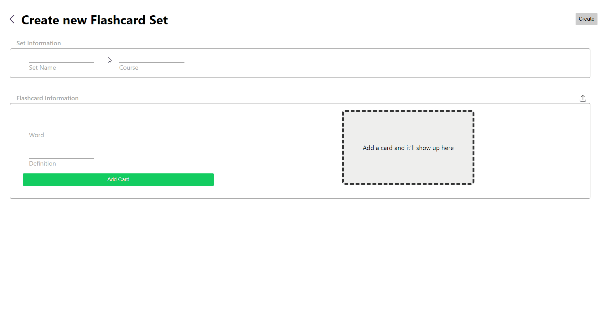

# MiniQuizlet
This was a project I made to help me improve my front-end knowledge and skills. I created a website that allows users to create flashcard sets for different classes, and then both browse and view them. The flashcard set information is stored in localStorage on the browser in JSON format.

# Demo
 
